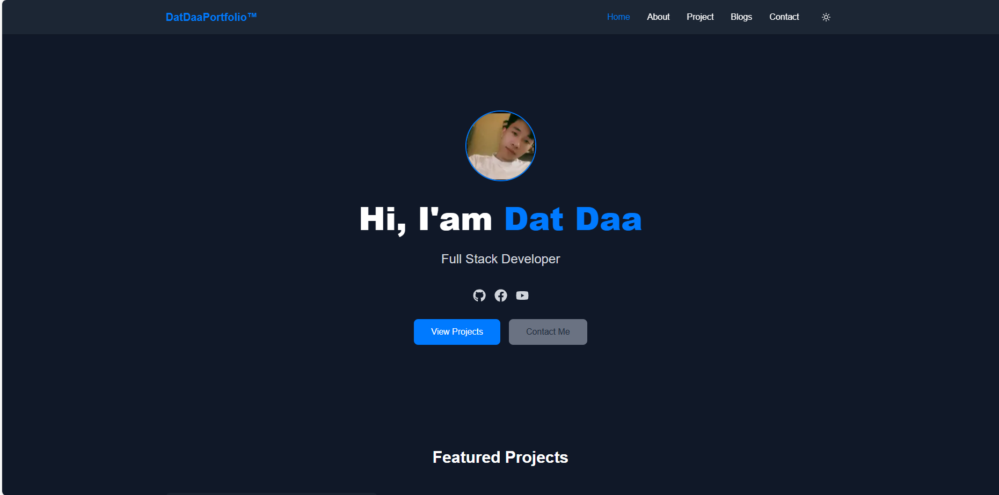
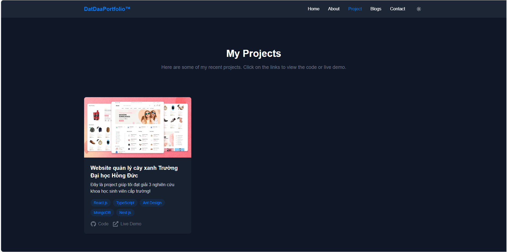
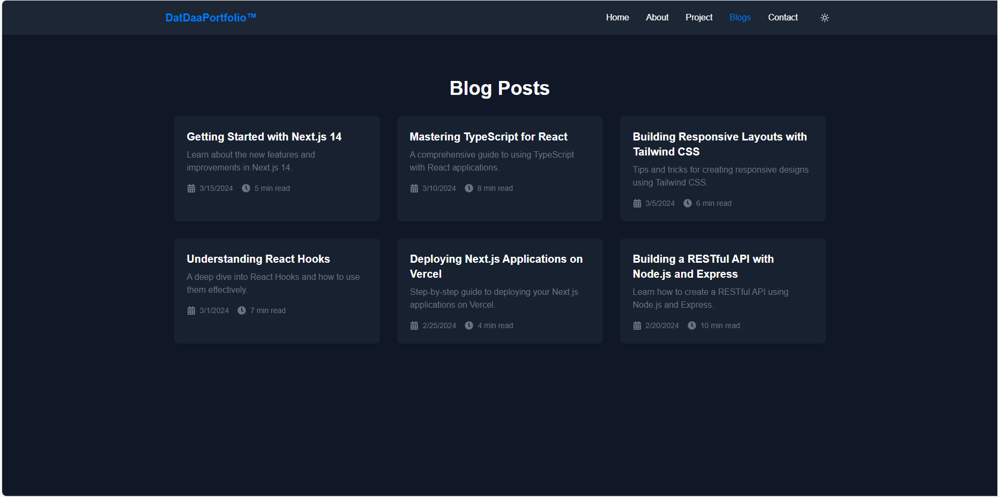

<!-- Title & Badges -->
<h1 align="center">🌱 My Portfolio - Built with Next.js & Tailwind CSS</h1>

<p align="center">
  
  
  
  
</p>

---

## ✨ Giới thiệu

Đây là **website cá nhân** được xây dựng bằng **Next.js**, **Tailwind CSS** và **Framer Motion**.  
Dự án này thể hiện khả năng xây dựng giao diện hiện đại, animation mượt mà, responsive và tối ưu hiệu năng.

👉 [Xem bản demo tại đây](https://next-js-portfolio-datdaa.vercel.app/)

---

## 🧠 Công nghệ sử dụng

- ⚡ **Next.js 15** – Framework mạnh mẽ trên nền React
- 🎨 **Tailwind CSS** – CSS tiện dụng, dễ tùy biến
- 🎞 **Framer Motion** – Animation chuyên nghiệp
- 🌙 **Dark Mode** – Tự động chuyển sáng/tối
- 📸 **Next/Image** – Tối ưu hóa hình ảnh thông minh
- 💡 **TypeScript** – Tránh lỗi & hỗ trợ code thông minh

---

## 🚀 Tính năng nổi bật

- ✅ Trang chủ giới thiệu
- ✅ Trang dự án (Projects)
- ✅ Trang blog (Bài viết kỹ thuật)
- ✅ About + kỹ năng lập trình
- ✅ Responsive 100% trên mọi thiết bị
- ✅ Dark Mode toggle
- ✅ Scroll animation

---

## 📸 Ảnh minh họa

| Trang chủ                          | Dự án                                  | Blog                               |
| ---------------------------------- | -------------------------------------- | ---------------------------------- |
|  |  |  |

---

## 🛠️ Cài đặt & chạy dự án

```bash
# Clone repo
git clone https://github.com/ntdatt812/next-js-portfolio-datdaa.git
cd next-js-portfolio-datdaa
# Cài dependencies
npm install

# Chạy project dev
npm run dev
```
